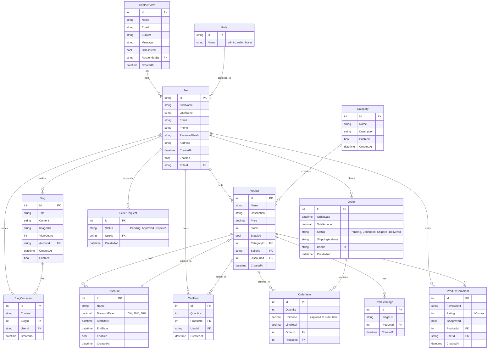

# 🛍️ eTicaret - E-Commerce Platform

A comprehensive, production-ready **multi-tier e-commerce application** built with **ASP.NET Core MVC** and **RESTful APIs**. Customers can browse products, manage shopping carts, place orders, and leave reviews. Administrators have a dedicated panel for inventory management, sales tracking, and user administration.

---

## 📸 Features

### 👤 Customer Side (`App.Eticaret`)
- 🔐 **Authentication** — Registration, login, logout via JWT with role-based authorization
- 🛒 **Shopping Cart** — Persistent cart with real-time quantity updates and price calculations
- 📦 **Order Placement** — Place orders with order history tracking and status updates
- 🍕 **Product Browsing** — View available products filtered by category with sorting and pagination
- ⭐ **Product Reviews** — Rate products (1-5 stars) with admin approval workflow
- 🧾 **Order History** — View past orders with order details, items, and pricing
- 📝 **Blog Section** — Read blog posts, leave comments, explore content
- 📞 **Contact Form** — Send inquiries to administrators with email notification

### 🛠️ Admin Panel (`App.Admin`)
- 📦 **Product Management** — Create, update, delete products with image upload and inventory control
- 🏷️ **Category Management** — Organize 9+ product categories (Meat, Vegetables, Fruits, etc.)
- 👥 **User Management** — Manage user accounts, assign roles (Admin, Seller, Buyer)
- 📊 **Sales Reports** — View daily, weekly, monthly sales analytics with trend analysis
- 💰 **Discount Management** — Configure promotional discounts with date ranges
- 📋 **Order Management** — Track all customer orders and modify statuses
- 🔍 **Review Moderation** — Approve/reject pending product reviews
- 📬 **Contact Inquiries** — View and manage customer contact form submissions

### 🔌 API Services (`App.Api.Data` & `App.Api.File`)
- **REST API (`/api/v1/`)** — Endpoints for authentication, products, categories, users, comments, and orders
- **JWT Authentication** — Secure token-based authentication with HttpOnly cookies
- **File Service API** — Upload, download, and delete product images and documents
- **Swagger Documentation** — Interactive API documentation at `/swagger`
- **FluentValidation** — Request validation with detailed error messages

---

## 🏗️ Architecture

The project follows **N-Tier Layered Architecture** principles with clear separation of concerns:

```
eTicaret Platform/
├── App.Eticaret          # Customer MVC Web App
├── App.Admin             # Admin MVC Web App
├── App.Api.Data          # REST API for business logic
├── App.Api.File          # REST API for file operations
├── App.Services          # Service layer abstractions (10+ interfaces)
├── App.Data              # EF Core DbContext & migrations
├── App.Models.DTO        # Request/Response DTOs
└── App.sln               # Solution file
```

### Layer Responsibilities

| Layer | Responsibility |
|---|---|
| **Web UI (MVC)** | `App.Eticaret` (Customer) and `App.Admin` (Admin) — Controllers, Views, static assets, session management |
| **API Layer** | `App.Api.Data` & `App.Api.File` — HTTP endpoints, JWT authentication, response formatting |
| **Service Layer** | `App.Services` — Business logic interfaces, repository pattern, data operations |
| **Data Layer** | `App.Data` — EF Core DbContext, entity configurations, migrations, data seeding |
| **Models** | `App.Models.DTO` — Data transfer objects with FluentValidation rules |

---

## 🛠️ Technologies Used

| Technology | Version | Purpose |
|---|---|---|
| **.NET** | 8.0 | Core framework |
| **ASP.NET Core MVC** | 8.0 | Web UI for customer and admin |
| **Entity Framework Core** | 8.0.7 | Code-First ORM with migrations |
| **SQL Server** | Latest | Relational database |
| **JWT Bearer** | ASP.NET Core Identity | Secure token-based authentication |
| **BCrypt** | Password hashing | Secure password storage |
| **AutoMapper** | 13.0.1 | DTO ↔ Entity mapping |
| **FluentValidation** | Latest | Request validation |
| **Ardalis.Result** | Pattern-based | Standardized API responses |
| **Bootstrap** | 5.x | Frontend UI framework |
| **Bootstrap Icons** | Icon library | UI icons |
| **Swagger/Swashbuckle** | API documentation | Interactive API explorer |

---

## 📁 Project Structure (Detailed)

```
App.Eticaret/                      # Customer Portal (MVC Web App)
├── Controllers/
│   ├── HomeController.cs          # Product listing, category filtering
│   ├── AuthController.cs          # Login, register, logout
│   ├── CartController.cs          # Add/remove items, view cart
│   ├── OrderController.cs         # Order placement, history view
│   ├── ProfileController.cs       # User profile management
│   ├── ProductController.cs       # Product details, reviews
│   ├── BlogController.cs          # Blog posts, comments
│   └── BaseController.cs          # Base controller with user info
├── ViewComponents/
│   └── BlogCategoriesSidebarViewComponent.cs
├── Views/
│   ├── Home/                      # Product catalog views
│   ├── Auth/                      # Login/Register forms
│   ├── Cart/                      # Shopping cart
│   ├── Order/                     # Order confirmation, history
│   ├── Product/                   # Product details, reviews
│   ├── Profile/                   # User profile
│   ├── Blog/                      # Blog posts
│   └── Shared/
│       ├── _Layout.cshtml         # Main layout template
│       ├── Header.cshtml          # Navigation header
│       └── Footer.cshtml          # Footer component
├── Models/
│   ├── ViewModels/
│   │   ├── HomeViewModel.cs       # Product list display
│   │   ├── LoginViewModel.cs      # Login form
│   │   ├── RegisterViewModel.cs   # Registration form
│   │   ├── OrderViewModel.cs      # Order details
│   │   └── ProductDetailViewModel.cs
│   └── CheckoutRequest.cs         # Order creation request
├── wwwroot/
│   ├── css/                       # Stylesheets
│   ├── js/                        # JavaScript files
│   ├── images/                    # Static images
│   └── lib/                       # Client libraries
├── appsettings.json               # Configuration
└── Program.cs                     # Startup configuration

App.Admin/                         # Admin Dashboard (MVC Web App)
├── Controllers/
│   ├── HomeController.cs          # Dashboard overview
│   ├── ProductController.cs       # Product CRUD operations
│   ├── CategoryController.cs      # Category management
│   ├── UserController.cs          # User & role management
│   ├── OrderController.cs         # Order tracking
│   ├── CommentController.cs       # Review moderation
│   ├── AuthController.cs          # Admin login
│   └── ReportController.cs        # Sales reports & analytics
├── Views/
│   ├── Home/                      # Dashboard
│   ├── Product/                   # Product management
│   ├── Category/                  # Category management
│   ├── User/                      # User management
│   ├── Order/                     # Order tracking
│   ├── Comment/                   # Review moderation
│   ├── Auth/                      # Admin login
│   ├── Report/                    # Sales reports
│   └── Shared/                    # Admin layouts
├── Models/
│   └── ViewModels/
│       ├── ProductListViewModel.cs
│       ├── CategoryListViewModel.cs
│       ├── SalesReportViewModel.cs
│       └── UserListViewModel.cs
├── wwwroot/
│   ├── css/                       # Admin stylesheets
│   ├── js/                        # Admin JavaScript
│   └── lib/
└── appsettings.json               # Configuration

App.Api.Data/                      # Main REST API
├── Controllers/
│   ├── AuthController.cs          # /api/v1/auth/* endpoints
│   ├── ProductController.cs       # /api/v1/products/* endpoints
│   ├── CategoryController.cs      # /api/v1/category/* endpoints
│   ├── OrderController.cs         # /api/v1/orders/* endpoints
│   ├── CommentController.cs       # /api/v1/comments/* endpoints
│   └── UserController.cs          # /api/v1/users/* endpoints
├── Program.cs                     # API configuration
└── appsettings.json               # Connection strings

App.Api.File/                      # File Management API
├── Controllers/
│   └── FileController.cs          # Upload, download, delete
├── Services/
│   ├── FileService.cs             # File operations
│   └── Extensions.cs              # Helper methods
└── appsettings.json               # File storage config

App.Services/                      # Service Layer
├── Abstract/
│   ├── IAuthService.cs            # Authentication service
│   ├── IProductService.cs         # Product operations
│   ├── ICategoryService.cs        # Category operations
│   ├── IOrderService.cs           # Order operations
│   ├── ICommentService.cs         # Comment/review service
│   ├── IUserService.cs            # User management
│   ├── IBlogService.cs            # Blog content
│   ├── IContactService.cs         # Contact inquiries
│   ├── IDiscountService.cs        # Discount management
│   └── IFileService.cs            # File operations
└── Concrete/
    ├── AuthService.cs
    ├── ProductService.cs
    ├── CategoryService.cs
    ├── OrderService.cs
    ├── CommentService.cs
    ├── UserService.cs
    ├── BlogService.cs
    ├── ContactService.cs
    ├── DiscountService.cs
    └── FileService.cs

App.Data/                          # Data Layer
├── ApplicationDbContext.cs        # EF Core DbContext
├── Configurations/
│   ├── UserConfiguration.cs
│   ├── ProductConfiguration.cs
│   ├── CategoryConfiguration.cs
│   ├── OrderConfiguration.cs
│   ├── OrderItemConfiguration.cs
│   ├── ProductImageConfiguration.cs
│   ├── CommentConfiguration.cs
│   ├── BlogConfiguration.cs
│   ├── BlogCommentConfiguration.cs
│   ├── DiscountConfiguration.cs
│   ├── CartItemConfiguration.cs
│   ├── ContactFormConfiguration.cs
│   └── RoleConfiguration.cs
├── Migrations/
│   ├── Initial migration
│   └── ... (subsequent migrations)
└── SeedData.cs                    # Initial data seeding

App.Models.DTO/                    # DTOs & Validation
├── Auth/
│   ├── LoginRequest.cs
│   ├── RegisterRequest.cs
│   ├── ResetPasswordRequest.cs
│   └── LoginResponse.cs
├── Product/
│   ├── CreateProductRequest.cs
│   ├── UpdateProductRequest.cs
│   └── ProductResponse.cs
├── Order/
│   ├── CreateOrderRequest.cs
│   ├── OrderResponse.cs
│   └── OrderItemResponse.cs
├── Comment/
│   ├── CreateCommentRequest.cs
│   └── CommentResponse.cs
├── User/
│   ├── UpdateUserRequest.cs
│   └── UserResponse.cs
├── Category/
│   ├── CreateCategoryRequest.cs
│   ├── UpdateCategoryRequest.cs
│   └── CategoryResponse.cs
├── Discount/
│   ├── CreateDiscountRequest.cs
│   └── DiscountResponse.cs
└── Blog/
    ├── CreateBlogRequest.cs
    └── BlogResponse.cs
```

---

## 📊 Database Schema & Relationships

The application uses **Entity Framework Core Code-First** with **17 main entities**:

### Entity Relationship Diagram



### Core Entities

#### **User** (Identity-based)
- Represents customers, sellers, and admins
- Fields: `Id`, `FirstName`, `LastName`, `Email`, `Phone`, `Address`, `PasswordHash`, `CreatedAt`, `Enabled`, `RoleId`
- Relationships: Places orders, writes reviews/comments, manages cart, writes blog posts

#### **Product**
- Menu items/products for sale
- Fields: `Id`, `Name`, `Description`, `Price`, `Stock`, `Enabled`, `CategoryId`, `SellerId`, `DiscountId`, `CreatedAt`
- Relationships: Belongs to category, seller (User), has discount, multiple images, reviews, and order items

#### **ProductImage**
- Gallery images for products
- Fields: `Id`, `ImageUrl`, `ProductId`, `CreatedAt`
- Cascade delete when product is deleted

#### **Category**
- Product categories (9 seeded: Meat, Vegetables, Fruits, etc.)
- Fields: `Id`, `Name`, `Description`, `Enabled`, `CreatedAt`
- Relationships: Contains multiple products

#### **Order** & **OrderItem**
- Order header and line items
- Order Fields: `Id`, `OrderDate`, `TotalAmount`, `Status`, `ShippingAddress`, `UserId`, `CreatedAt`
- OrderItem Fields: `Id`, `Quantity`, `UnitPrice` (captured at order time), `LineTotal`, `OrderId`, `ProductId`
- Prevents price changes after order placement

#### **ProductComment** (Reviews)
- Product ratings and reviews (1-5 stars)
- Fields: `Id`, `ReviewText`, `Rating`, `IsApproved`, `ProductId`, `UserId`, `CreatedAt`
- Admin approval workflow before display

#### **Discount**
- Promotional discounts with date ranges
- Fields: `Id`, `Name`, `DiscountRate`, `StartDate`, `EndDate`, `Enabled`, `CreatedAt`
- 3 seeded discounts: 10%, 20%, 30%

#### **CartItem**
- Persistent shopping cart
- Fields: `Id`, `Quantity`, `ProductId`, `UserId`, `CreatedAt`
- Survives between sessions

#### **Blog** & **BlogComment**
- Blog posts and comments
- Blog Fields: `Id`, `Title`, `Content`, `ImageUrl`, `ViewCount`, `AuthorId`, `CreatedAt`, `Enabled`
- BlogComment Fields: `Id`, `Content`, `BlogId`, `UserId`, `CreatedAt`

#### **ContactForm**
- Customer inquiry submissions
- Fields: `Id`, `Name`, `Email`, `Subject`, `Message`, `IsResolved`, `RespondedBy`, `CreatedAt`

#### **Role**
- Three roles: **admin**, **seller**, **buyer**
- Assigned to users for authorization

---

## 🔌 API Endpoints

### Authentication (`/api/v1/auth`)
```
POST   /api/v1/auth/register         # User registration
POST   /api/v1/auth/login            # User login (returns JWT)
POST   /api/v1/auth/refresh-token    # Refresh access token
POST   /api/v1/auth/reset-password   # Reset password with token
GET    /api/v1/auth/verify-email     # Email verification
```

### Products (`/api/v1/products`)
```
GET    /api/v1/products              # List all products (paginated, filtered)
GET    /api/v1/products/{id}         # Get product details
POST   /api/v1/products              # Create product [Seller/Admin]
PUT    /api/v1/products/{id}         # Update product [Seller/Admin]
DELETE /api/v1/products/{id}         # Delete product [Admin]
```

### Categories (`/api/v1/category`)
```
GET    /api/v1/category              # List all categories
GET    /api/v1/category/{id}         # Get category details
POST   /api/v1/category              # Create category [Admin]
PUT    /api/v1/category/{id}         # Update category [Admin]
DELETE /api/v1/category/{id}         # Delete category [Admin]
```

### Orders (`/api/v1/orders`)
```
GET    /api/v1/orders                # List user's orders
GET    /api/v1/orders/{id}           # Get order details
POST   /api/v1/orders                # Create order [Buyer]
PUT    /api/v1/orders/{id}           # Update order status [Admin]
```

### Comments/Reviews (`/api/v1/comments`)
```
GET    /api/v1/comments              # List approved reviews
POST   /api/v1/comments              # Submit review [Buyer]
PUT    /api/v1/comments/{id}         # Approve/reject review [Admin]
DELETE /api/v1/comments/{id}         # Delete review [Admin]
```

### Users (`/api/v1/users`)
```
GET    /api/v1/users                 # List users [Admin]
GET    /api/v1/users/{id}            # Get user profile
PUT    /api/v1/users/{id}            # Update profile [User]
DELETE /api/v1/users/{id}            # Delete account [Admin]
POST   /api/v1/users/{id}/assign-role # Assign role [Admin]
```

### Files (`/api/v1/files`)
```
POST   /api/v1/files/upload          # Upload image
GET    /api/v1/files/download/{id}   # Download file
DELETE /api/v1/files/{id}            # Delete file
```

**API Documentation**: Visit `/swagger` after running the API for interactive Swagger UI.

---

## ⚙️ Setup & Running

### Prerequisites

- [.NET 8 SDK](https://dotnet.microsoft.com/download/dotnet/8.0)
- [SQL Server](https://www.microsoft.com/en-us/sql-server/sql-server-downloads) (LocalDB or full version)
- Visual Studio 2022+ or VS Code + PowerShell

### Installation Steps

1. **Clone the repository:**
   ```bash
   git clone https://github.com/yourusername/eTicaret.git
   cd eTicaret
   ```

2. **Configure the connection string:**

   Edit `App.Data/appsettings.json`:
   ```json
   {
     "ConnectionStrings": {
       "Default": "Server=.;Database=eTicaretDb;Trusted_Connection=True;TrustServerCertificate=Yes;"
     },
     "AppUrls": {
       "Frontend": "https://localhost:7114",
       "Admin": "https://localhost:5001",
       "Api": "https://localhost:5002"
     },
     "FileStorage": {
       "UploadPath": "C:\\eTicaret\\Uploads"
     }
   }
   ```

3. **Create upload directory** (for file service):
   ```bash
   mkdir C:\eTicaret\Uploads
   ```

4. **Apply migrations and create database:**
   ```bash
   cd App.Data
   dotnet ef database update --startup-project ../App.Api.Data
   ```

5. **Restore dependencies:**
   ```bash
   dotnet restore
   ```

6. **Run the projects** (in separate terminals):

   **API Service (Main):**
   ```bash
   cd App.Api.Data
   dotnet run
   ```
   → API runs on `https://localhost:5002` (see launchSettings.json)

   **File Service API:**
   ```bash
   cd App.Api.File
   dotnet run
   ```
   → File API runs on `https://localhost:5003`

   **Customer Portal:**
   ```bash
   cd App.Eticaret
   dotnet run
   ```
   → Customer site on `https://localhost:7114`

   **Admin Panel:**
   ```bash
   cd App.Admin
   dotnet run
   ```
   → Admin dashboard on `https://localhost:5001`

7. **Access the applications:**
   - **Customer Portal**: https://localhost:7114
   - **Admin Panel**: https://localhost:5001
   - **API Documentation**: https://localhost:5002/swagger
   - **File API**: https://localhost:5003

### Default Credentials

> On first run, `SeedData` creates default roles and accounts:

| Role | Email | Password |
|---|---|---|
| **Admin** | admin@eticaret.com | Admin123!@# |
| **Seller** | seller@eticaret.com | Seller123!@# |
| **Buyer** | buyer@eticaret.com | Buyer123!@# |

⚠️ **Change these credentials immediately in production!**

### Seeded Data

The application automatically seeds:
- **Roles**: Admin, Seller, Buyer
- **Users**: 3 test accounts (admin, seller, buyer)
- **Categories**: 9 categories (Meat, Vegetables, Fruits, Dairy, Bakery, Beverages, Frozen, Organic, Special)
- **Products**: ~15 sample products with images and pricing
- **Discounts**: 3 promotional rates (10%, 20%, 30%)

---

## 🔒 Security

- **Password Storage**: BCrypt hashing with unique salts
- **Authentication**: JWT tokens with issuer/audience validation
- **Token Storage**: HttpOnly cookies to prevent XSS attacks
- **Authorization**: Role-based access control (Admin, Seller, Buyer)
- **Validation**: FluentValidation on all DTOs with detailed error messages
- **CSRF Protection**: AntiForgeryToken on all POST forms in MVC
- **CORS**: Configured for frontend and admin URLs
- **Session Security**: 
  - 30-minute inactivity timeout
  - Secure flag on cookies
  - Same-Site policy enforcement

### Authorization Rules

```
Public Endpoints:
  - Register, Login, Product List, Category List, Blog Posts

Buyer-Only:
  - Add to cart, Create order, Write reviews, My orders

Seller-Only:
  - Create/update products, View sales analytics

Admin-Only:
  - User management, Discount configuration, Review moderation
  - Contact form management, Role assignment
```

---

## 📝 Database Migration Guide

### Creating a New Migration

```bash
cd App.Data
dotnet ef migrations add <MigrationName> --startup-project ../App.Api.Data
```

### Updating Database

```bash
dotnet ef database update --startup-project ../App.Api.Data
```

### Reverting Last Migration

```bash
dotnet ef migrations remove --startup-project ../App.Api.Data
```

---

## 🤖 Development Notes

- **Entity Configurations**: Each entity has a Fluent API configuration in `App.Data/Configurations/`
- **Composite Keys**: `OrderItem` uses composite key `(OrderId, ProductId)` to ensure unique items per order
- **Cascade Deletes**: Only `ProductImage` and `BlogComment` cascade delete; other deletions preserve historical data
- **Soft Deletes**: Entities use `Enabled` flag instead of hard deletes
- **Audit Trail**: All entities include `CreatedAt` timestamp
- **AutoMapper**: DTO ↔ Entity mappings configured in service layer

---

## 📄 License

This project was created for educational and commercial development purposes.

---

## 📬 Contact & Support

For questions, issues, or suggestions:
- Open an issue on GitHub
- Contact: support@eticaret.com

---

## 👨‍💻 Development Team

Built with ❤️ by [Your Name/Team]

**Last Updated**: June 2, 2026
      ↓                 ↓
  App.Services  ←  App.Api.Data
      ↓                 ↓
  App.Data      App.Api.File
```

---

## 🔧 Technology Stack

### Core Framework
- **.NET 8.0** - Latest long-term support version
- **ASP.NET Core MVC** - Web framework for both frontend apps
- **Entity Framework Core 8.0.7** - ORM with SQL Server
- **SQL Server** - Database engine

### Libraries & Packages
| Package | Version | Purpose |
|---------|---------|---------|
| `AutoMapper` | 13.0.1 | Object-to-object mapping (ViewModels ↔ DTOs) |
| `FluentValidation` | 11.9.2 | Request DTO validation |
| `Ardalis.Result` | 9.1.0 | Result pattern for standardized API responses |
| `Microsoft.AspNetCore.Authentication.JwtBearer` | 8.0.7 | JWT token authentication |
| `BCrypt.Net-Next` | 4.0.3 | Password hashing and verification |
| `Swashbuckle.AspNetCore` | 6.6.2 | Swagger/OpenAPI documentation |
| `IdentityModel` | 7.0.0 | JWT token utilities |

### Key Patterns
- **JWT Bearer Authentication** - Token-based auth stored in HttpOnly cookies
- **Result Pattern** - Standardized response wrapping
- **DTO Pattern** - Request/Response objects separate from domain entities
- **Service Layer** - Interface-based services for testability
- **Repository Pattern** - Data access abstraction

---

## ✨ Core Features

### 1. **User Management**
- Registration with email validation
- Login/Logout with JWT tokens
- Password reset with token verification
- User profile management
- Role assignment (Admin, Seller, Buyer)
- Account enable/disable
- Seller request system

### 2. **Product Management**
- Create/Read/Update/Delete products
- Stock quantity tracking and adjustment
- Product categorization (9 categories: Meat, Vegetables, Fruits, etc.)
- Discount application (10%, 20%, 30% rates)
- Product images/gallery with multiple URLs
- Seller-specific product listings
- Product status management (Enable/Disable)

### 3. **Shopping Experience**
- Product browsing with filtering
- Shopping cart management (add/update/remove)
- Persistent cart storage per user
- Order placement from cart
- Order history and tracking
- Unique order codes for reference
- Delivery address storage

### 4. **Product Reviews & Ratings**
- 1-5 star rating system
- Review text and star count storage
- Admin approval workflow for reviews
- Confirmation status tracking

### 5. **Blog System**
- Blog post creation and publishing
- Featured image support
- Blog categorization and tagging
- Comment system with approval workflow
- Blog comment management

### 6. **Admin Features**
- User management and role assignment
- Product inventory management
- Comment approval (products & blogs)
- Order tracking and management
- User status management
- Seller request handling

### 7. **File Management**
- File upload endpoint
- File download with versioning
- File deletion capability
- Separate dedicated file service

### 8. **Contact Management**
- Public contact form submission
- Message tracking (viewed/unviewed)
- Admin notification system

---

## 📊 Database Schema

### Entity Diagram
```
User ────────────┐
  ├─→ Product (as Seller)
  ├─→ Cart Items
  ├─→ Orders
  ├─→ Blogs
  └─→ Comments (Product & Blog)

Category ──→ Product
Discount ──→ Product
Product ──→ Images (cascade delete)
Product ──→ Comments
Order ──→ OrderItems
Blog ──→ BlogComments (cascade delete)
```

### Key Entities

#### **User**
```csharp
Id, Email (unique), FirstName, LastName, Password (hashed),
ResetPasswordToken, RoleId (FK), Enabled, HasSellerRequest, CreatedAt
```

#### **Product**
```csharp
Id, SellerId (FK), CategoryId (FK), DiscountId (FK),
Name, Price (decimal), Description, StockAmount, Enabled, CreatedAt
```

#### **Order & OrderItem**
```csharp
Order: Id, UserId (FK), OrderCode (unique), Address, CreatedAt
OrderItem: Id, OrderId (FK), ProductId (FK), Quantity, UnitPrice, CreatedAt
```

#### **Cart**
```csharp
CartItem: Id, UserId (FK), ProductId (FK), Quantity (1-255), CreatedAt
```

#### **Review & Comments**
```csharp
ProductComment: Id, ProductId (FK), UserId (FK), Text, StarCount, IsConfirmed
BlogComment: Id, BlogId (FK), Name, Email, Comment, IsApproved
```

#### **Supporting Entities**
```csharp
Category: Id, Name, Color, IconCssClass
Discount: Id, DiscountRate (%), StartDate, EndDate, Enabled
Role: Id, Name (admin/seller/buyer)
ProductImage: Id, ProductId (FK), Url
Blog: Id, Title, Content, ImageUrl, UserId (FK), Enabled
ContactForm: Id, Name, Email, Message, SeenAt
```

### Seeded Data
- **3 Roles**: admin, seller, buyer
- **9 Categories**: Fresh Meat, Vegetables, Fresh Fruits, Dried Fruits & Nuts, Ocean Foods, Butter & Eggs, Fastfood, Oatmeal, Juices
- **3 Sample Discounts**: 10%, 20%, 30%
- **Sample Users & Products** with images

---

## 🌐 API Architecture

### App.Api.Data Endpoints
**Base Route**: `/api/v1/`

#### Authentication
```
POST   /auth/login              - User login → JWT token
POST   /auth/register           - New user registration
POST   /auth/forgot-password    - Request password reset email
POST   /auth/reset-password     - Complete password reset
POST   /auth/refresh-token      - Renew JWT token
```

#### Products
```
GET    /products                - List all products (paged)
GET    /products/{id}           - Get product details
POST   /products                - Create product (seller)
PUT    /products/{id}           - Update product
DELETE /products/{id}           - Delete product
POST   /products/{id}/change-status   - Toggle enabled/disabled
POST   /products/{id}/change-stock    - Adjust stock quantity
POST   /products/{id}/reviews         - Add product review
```

#### Categories
```
GET    /category                - List all categories
POST   /category                - Create category (admin)
PUT    /category/{id}           - Update category
```
*Note: Route is singular `/category`, not plural*

#### Users (Admin)
```
GET    /users                   - List users (paged, admin only)
GET    /users/{id}              - Get user details
PUT    /users/{id}              - Update user profile
POST   /users/{id}/change-role  - Assign role (admin only)
POST   /users/{id}/change-status - Enable/disable user (admin only)
```

#### Comments & Reviews
```
GET    /comments                - List comments (paged)
POST   /comments                - Create comment/review
PUT    /comments/{id}           - Update comment
DELETE /comments/{id}           - Delete comment
POST   /comments/{id}/approve   - Approve comment (admin only)
```

### App.Api.File Endpoints
**Base Route**: `/api/file/`

```
POST   /upload                  - Upload file (multipart/form-data)
GET    /download/{fileId}       - Download file
DELETE /delete                  - Delete file
```

### Response Format
All endpoints return standardized Result pattern:
```json
{
  "isSuccess": true,
  "value": { /* data */ },
  "errors": []
}
```

### Authentication
- **Method**: JWT Bearer token in Authorization header or `auth-token` cookie
- **Roles**: Checked via JWT claims
- **Endpoints**: Most protected except `/auth/*`

---

## 🏛️ Service Layer Architecture

### Service Interfaces (App.Services)
```csharp
IAuthService          // Login, register, password reset, tokens
IProductService       // Product CRUD, stock, filtering
ICategoryService      // Category management
IOrderService         // Order creation, history, tracking
ICartService          // Cart items, totals, checkout
ICommentService       // Review/comment creation and approval
IUserService          // User CRUD, role assignment
IProfileService       // User profile viewing/editing
IFileService          // File upload/download
IMailService          // Email notifications
```

### Service Implementations
- **AuthApiService** - HttpClient wrapper for auth endpoints
- **EmailService** - SMTP email delivery
- **FileApiService** - HttpClient wrapper for file operations

---

## 📁 Project Structure

### App.Eticaret (Customer Portal)
```
App.Eticaret/
├── Controllers/
│   ├── BaseController.cs       - Base class with auth helpers
│   ├── HomeController.cs       - Landing, products, about, contact
│   ├── ProductController.cs    - Product browsing
│   ├── CartController.cs       - Shopping cart
│   ├── OrderController.cs      - Order history
│   ├── AuthController.cs       - Login/register
│   ├── ProfileController.cs    - User profile
│   ├── BlogController.cs       - Blog browsing
│   └── CommentController.cs    - Product reviews
├── Models/
│   └── ViewModels/             - MVC view models
├── Views/
│   ├── Home/                   - Home page views
│   ├── Product/                - Product listing/detail
│   ├── Cart/                   - Shopping cart UI
│   ├── Order/                  - Order management UI
│   ├── Auth/                   - Login/register forms
│   ├── Profile/                - User profile UI
│   ├── Blog/                   - Blog views
│   ├── Comment/                - Review UI
│   └── Shared/                 - Layout, partials
├── wwwroot/
│   ├── css/                    - Stylesheets
│   ├── js/                     - JavaScript
│   ├── lib/                    - Third-party libraries
│   └── theme/                  - Custom theme assets
└── Program.cs                  - Startup configuration
```

### App.Admin (Admin Panel)
```
App.Admin/
├── Controllers/
│   ├── HomeController.cs       - Dashboard
│   ├── ProductController.cs    - Product management
│   ├── UserController.cs       - User management
│   ├── CategoryController.cs   - Category management
│   ├── CommentController.cs    - Comment approval
│   └── AuthController.cs       - Admin login
├── Models/
│   └── ViewModels/             - Admin view models
├── Views/
│   ├── Home/                   - Dashboard
│   ├── Product/                - Product CRUD
│   ├── User/                   - User management
│   ├── Category/               - Category management
│   ├── Comment/                - Comment approval
│   └── Shared/                 - Layout
├── wwwroot/
│   ├── css/
│   ├── js/
│   ├── lib/
│   └── theme/
└── Program.cs
```

### App.Api.Data (Main API)
```
App.Api.Data/
├── Controllers/
│   ├── AuthController.cs       - Auth endpoints
│   ├── ProductController.cs    - Product endpoints
│   ├── CategoryController.cs   - Category endpoints
│   ├── UserController.cs       - User endpoints
│   └── CommentController.cs    - Comment endpoints
├── Services/
│   └── (Implementation details)
└── Program.cs
```

### App.Api.File (File Service)
```
App.Api.File/
├── Controllers/
│   └── FileController.cs       - Upload/download/delete
├── Services/
│   ├── FileService.cs
│   └── Extensions.cs
└── Program.cs
```

### App.Data (Data Layer)
```
App.Data/
├── Entities/
│   ├── UserEntity.cs
│   ├── ProductEntity.cs
│   ├── OrderEntity.cs
│   ├── OrderItemEntity.cs
│   ├── CartItemEntity.cs
│   ├── ProductCommentEntity.cs
│   ├── BlogEntity.cs
│   ├── BlogCommentEntity.cs
│   ├── CategoryEntity.cs
│   ├── DiscountEntity.cs
│   ├── ProductImageEntity.cs
│   ├── RoleEntity.cs
│   ├── ContactFormEntity.cs
│   ├── BlogTagEntity.cs
│   ├── BlogCategoryEntity.cs
│   ├── RelBlogTagEntity.cs
│   ├── RelBlogCategoryEntity.cs
│   └── EntityBase.cs
├── Infrastructure/
│   ├── ApplicationDbContext.cs - EF Core DbContext
│   ├── DataRepository.cs       - Repository abstraction
│   └── IEntityTypeSeed.cs      - Seeding interface
├── EntityBase.cs               - Base class for all entities
├── IHasEnabled.cs              - Soft-enable interface
└── DataExtensions.cs           - DI configuration
```

### App.Services
```
App.Services/
├── Abstract/
│   ├── IAuthService.cs
│   ├── IProductService.cs
│   ├── IOrderService.cs
│   ├── ICartService.cs
│   ├── ICommentService.cs
│   ├── IUserService.cs
│   ├── IProfileService.cs
│   ├── IFileService.cs
│   ├── ICategoryService.cs
│   └── IMailService.cs
├── Concrete/
│   ├── AuthApiService.cs
│   ├── EmailService.cs
│   └── FileApiService.cs
├── AppServiceBase.cs           - Base service class
└── App.Services.csproj
```

### App.Models.DTO
```
App.Models.DTO/
├── Auth/
│   ├── AuthLoginRequest.cs     (with FluentValidation)
│   ├── AuthLoginResult.cs
│   ├── AuthRegisterRequest.cs  (with FluentValidation)
│   ├── AuthForgotPasswordRequest.cs
│   ├── AuthResetPasswordRequest.cs
│   └── AuthRefreshTokenRequest.cs
├── Product/
│   ├── ProductGetResult.cs
│   ├── ProductCreateRequest.cs
│   ├── ProductUpdateRequest.cs
│   ├── ProductChangeStatusRequest.cs
│   ├── ProductChangeStockRequest.cs
│   ├── ProductReviewRequest.cs
│   └── ProductGetPagedRequest.cs
├── Order/
│   ├── OrderGetResult.cs
│   ├── OrderPlaceRequest.cs
│   └── OrderGetRequest.cs
├── Cart/
│   ├── CartGetResult.cs
│   ├── CartUpdateRequest.cs
│   └── CartUpdateResult.cs
├── Category/
│   ├── CategoryGetResult.cs
│   └── CategoryCreateRequest.cs
├── User/
│   ├── UserGetResult.cs
│   ├── UserGetPagedRequest.cs
│   ├── UserUpdateRequest.cs
│   ├── UserChangeRoleRequest.cs
│   └── UserChangeStatusRequest.cs
├── Comment/
│   ├── CommentCreateRequest.cs
│   ├── CommentGetResult.cs
│   ├── CommentApproveResult.cs
│   └── CommentUpdateRequest.cs
├── Profile/
│   ├── ProfileGetResult.cs
│   └── ProfileUpdateRequest.cs
├── File/
│   ├── FileUploadResult.cs
│   ├── FileDownloadRequest.cs
│   └── FileDownloadResult.cs
├── Mail/
│   └── MailSendRequest.cs
├── ContactForm/
│   └── ContactFormCreateRequest.cs
└── App.Models.DTO.csproj
```

---

## 🚀 Development Setup

### Prerequisites
- **.NET 8.0 SDK** or later
- **SQL Server** (LocalDB or full edition)
- **Visual Studio 2022** or VS Code with C# extension
- **Git**

### Getting Started

1. **Clone the repository**
   ```bash
   git clone <repository-url>
   cd eTicaretUygulamas-
   ```

2. **Configure Database**
   - Update connection string in `appsettings.json` files:
     ```json
     {
       "ConnectionStrings": {
         "SqlServer": "Server=(localdb)\\mssqllocaldb;Database=eTicaretDb;Trusted_Connection=true;"
       }
     }
     ```

3. **Restore NuGet Packages**
   ```bash
   dotnet restore
   ```

4. **Create Database & Seed Data**
   ```bash
   cd App.Data
   dotnet ef database update
   ```

5. **Run the Applications**
   
   **Customer Portal** (App.Eticaret):
   ```bash
   cd App.Eticaret
   dotnet run
   # Open https://localhost:7114
   ```
   
   **Main API** (App.Api.Data):
   ```bash
   cd App.Api.Data
   dotnet run
   # Swagger available at https://localhost:<port>/swagger
   ```
   
   **File API** (App.Api.File):
   ```bash
   cd App.Api.File
   dotnet run
   # Swagger available at https://localhost:<port>/swagger
   ```
   
   **Admin Panel** (App.Admin):
   ```bash
   cd App.Admin
   dotnet run
   # Open https://localhost:<port>
   ```

### Environment Configuration

**App.Eticaret & App.Admin** `appsettings.json`:
```json
{
  "ExternalApis": {
    "DataApi": "https://localhost:5001",
    "FileApi": "https://localhost:5002"
  },
  "Jwt": {
    "Issuer": "your-app-name"
  }
}
```

**App.Api.Data** `appsettings.json`:
```json
{
  "ConnectionStrings": {
    "SqlServer": "Server=...;Database=eTicaretDb;..."
  },
  "Jwt": {
    "Issuer": "your-app-name",
    "SecretKey": "your-secret-key-here"
  },
  "AppUrls": {
    "Frontend": "https://localhost:7114"
  }
}
```

---

## 🔐 Security Features

### Authentication
- **JWT Tokens**: Signed tokens with issuer validation
- **HttpOnly Cookies**: Prevents JavaScript access to tokens
- **Token Refresh**: Renew tokens without re-login
- **Password Reset**: Token-based password recovery

### Password Security
- **BCrypt Hashing**: Industry-standard password hashing
- **Minimum Length**: 4+ characters (can be increased)
- **Validation**: Email format and length constraints

### Authorization
- **Role-Based Access Control**: Admin, Seller, Buyer roles
- **Claim-Based**: Roles encoded in JWT claims
- **Endpoint Protection**: `[Authorize]` and `[AllowAnonymous]` attributes

### Data Validation
- **FluentValidation**: Fluent API for validation rules
- **DTOs**: Validation applied at API boundaries
- **Length Constraints**: Database-enforced max lengths

---

## 📝 Important Notes

### API Routes
- **Category endpoint is singular**: `/api/v1/category` (not `/categories`)
- Use `category` in frontend HTTP calls

### Password Reset
- Emails should use `AppUrls:Frontend` config value for reset link
- Don't hardcode localhost URLs in templates

### Development Ports
- **Customer Portal**: https://localhost:7114
- **Admin Panel**: https://localhost:<dynamic-port>
- **Data API**: https://localhost:<dynamic-port>
- **File API**: https://localhost:<dynamic-port>

### Data Seeding
- Seeding occurs during `DbContext` configuration
- Test data includes sample users, products, categories, discounts
- Modify seed data in entity configuration classes

---

## 🎓 Architecture Highlights

### Design Patterns
- **Service Layer Pattern**: Business logic separated from controllers
- **Repository Pattern**: Data access abstraction
- **DTO Pattern**: Request/response objects separate from entities
- **Result Pattern**: Standardized API responses with Ardalis.Result
- **Factory Pattern**: Registered HttpClient factories for APIs

### Separation of Concerns
- **Controllers**: Handle HTTP requests/responses only
- **Services**: Contain business logic and validation
- **DTOs**: Define data contracts
- **Entities**: Represent database schema
- **Configurations**: Entity mapping and seeding logic

### Scalability
- Microservices-lite: Separate APIs for data and file operations
- HTTP-based service communication
- Easy to extract to independent services later

---

## 📚 Additional Resources

### Learn More
- [.NET 8.0 Documentation](https://learn.microsoft.com/en-us/dotnet/)
- [Entity Framework Core](https://learn.microsoft.com/en-us/ef/core/)
- [ASP.NET MVC](https://learn.microsoft.com/en-us/aspnet/core/mvc/overview)
- [JWT Authentication](https://learn.microsoft.com/en-us/aspnet/core/security/authentication/jwt)
- [AutoMapper](https://automapper.org/)
- [FluentValidation](https://fluentvalidation.net/)

---

## 📄 License

[Add your license information here]

---

**Last Updated**: June 2, 2026  
**Version**: 1.0.0  
**Maintainers**: [Your Team]
